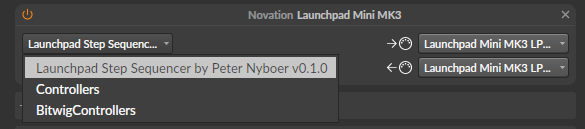
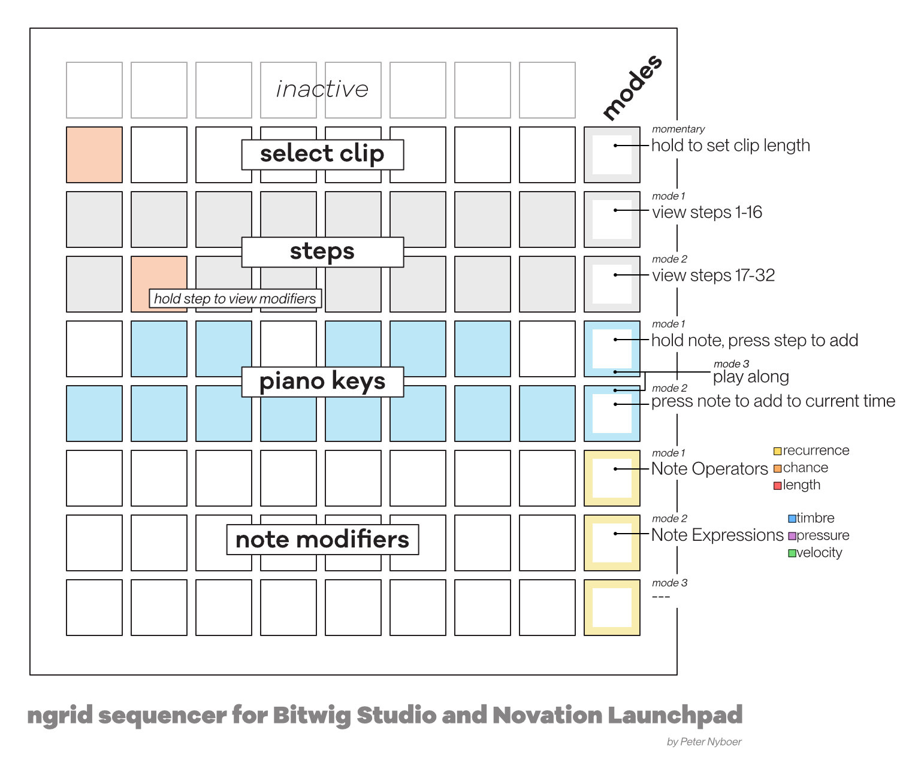

# ngrid Manual

For Bitwig Studio and Novation Launchpad Mini MK3.

The ngrid sequencer acts on a track of MIDI clips to sequence and modify notes. 
Select a clip, add notes with the piano keyboard and step sequencer, and edit notes with operators and expressions.  

Rows are numbered the way Novation numbers them: **row 7 at the top**, **row 0 at the
bottom**. The grid is 8x8; the 9th column just to the right of the grid is the
**Modifier Column** - eight extra buttons, one per row, that don't light up as part of
the grid itself but act as mode switches and hold-buttons for the features below.

## Install
Put the LaunchpadStepSequencer.bwextension file in your Bitwig Extensions folder (Documents/Bitwig/Extensions).
In Bitwig’s settings/controllers, add a Novation Launchpad Mini MK3 controller and select "Launchpad Step Sequencer by Peter Nyboer vx.x.x"

## Callouts

## The rows

| Row | Function |
|---|---|
| 7 (top) | **Clip launcher** - 8 clip slots for the currently selected track |
| 6 | **Step toggle**, steps 1-8 |
| 5 | **Step toggle**, steps 9-16 |
| 4 | **Piano, black keys** (one octave); columns 1 and 8 are octave shift, not notes |
| 3 | **Piano, white keys** (one octave) |
| 2 | **Modifier row** - top |
| 1 | **Modifier row** - middle |
| 0 (bottom) | **Modifier row** - bottom |

What the bottom three rows  actually control depends on the current **Modifier Column mode** (see
below) - they're shared real estate between Note Ops and Note Expressions editing.

## Clip launcher (row 7)

Press an empty pad to create and select a new one-bar clip. Press a pad that already
has a clip to select and launch it.

**Hold** a clip pad to set Note Operators and Expressions to apply Operator and Expression values to all notes in a clip. 

## Step toggles (rows 6 and 5)

Row 6 and 5 show step toggles for the current page: steps 1-16 or 17-32. 
By default a new clip is 16 steps, press the *page 2* button to extend a clip to 32 steps and view the second page.

- **Tap** a step to toggle it. The step is
  cleared it if it has a note, or one is added at the last pitch you used.
- **Hold** a piano key and press a step: adds/removes a note with that
  pitch on that step.
- **Hold** a step pad by itself: nothing happens immediately, but the bottom three rows  light up to
  show that step's current modifiers: recurrence/chance/length or
  timbre/pressure/velocity, depending on mode. With the pad held, you can edit the note modifies with the bottom buttons.

If a step holds a note longer than one step, the pads it sustains through light in a
dimmer version of the clip's color. Tapping a dimmer "sustain" pad does nothing, and
holding one shows no modifiers to edit either - only the pad the note actually starts
on can be tapped or held to work with it.

While a clip is playing, the step currently under the playhead lights white.

## Piano (rows 4 and 3)

Below the steps is a one octave piano keyboard. Row 4 is the black keys, row 3 is the white keys. 
The behavior depends on the **piano mode** (see Piano Modes below). By default,
holding a key and pressing a step places a note as described above.

The two end pads of the black-key row (columns 1 and 8) aren't notes - they shift the
octave down/up. They light yellow/orange/red for one/two/three octaves of shift in
that direction, and go dark at no shift. Octave shift always works the same way
regardless of which piano mode is active.

### Piano modes

These pick what pressing a piano key actually does. Same press/chord pattern as the
view buttons above:

- **Mode 1 (default): Hold mode** - hold a piano key and press a step to place
  a note there, as described under Step toggles.
- **Mode 2: Live-step mode** - pressing a piano key immediately toggles that
  pitch on whatever step the playhead is currently on (jumping the view to that page
  first if needed). No step pad needed - useful for recording live while the clip
  plays. Also sounds the note as you press it (same as Play-along mode below, and
  with the same "Launchpad Seq Play Along" input requirement) so you can hear what
  you're entering.
- **Hold both together: Play-along mode** - pressing a piano key just plays the
  note (you'll need to select "Launchpad Seq Play Along” or “All Ins" as a track's input in Bitwig
  to actually hear anything) and writes nothing to the clip.

## Modifier Column

The 8 buttons down the right edge, one per row. From top to bottom:

| Button (CC) | Row it sits next to | Function |
|---|---|---|
| CC89 | row 7 (clips) | Set clip length |
| CC79 | row 6 | View: page 1 (steps 1-16) |
| CC69 | row 5 | View: page 2 (steps 17-32) |
| CC59 | row 4 (black keys) | Piano mode: Hold |
| CC49 | row 3 (white keys) | Piano mode: Live-step |
| CC39 | row 2 | Modifier mode: Note Ops |
| CC29 | row 1 | Modifier mode: Note Expressions |
| CC19 | row 0 | *Reserved - not currently used* |

### Modifier mode: Note Ops / Note Expressions

These two are a radio-button pair - pressing one selects it and lights it white; the
other goes dark. They decide what the bottom three rows  display and edit for the held step (or the
whole clip, if a clip pad is held instead):

**Note Ops (default):**
- Row 2 - **recurrence pattern** (yellow): which of 8 playback cycles the note fires
  on. Each column toggles one cycle in the pattern.
- Row 1 - **chance** (orange): a 0-8 bar in 12.5% steps, from 0% up to 100%.
- Row 0 - **note length** (red): in 1/16-step increments, from 1/16 up to 8/16 of a
  bar.

**Note Expressions:**
- Row 2 - **timbre** (blue): bipolar, -100 to +100. Each column alone sets one of 8
  values that skip zero (-100, -75, -50, -25, 25, 50, 75, 100); holding two adjacent
  columns together lands on the midpoint between them (e.g. the two middle columns
  together give exactly 0).
- Row 1 - **pressure** (purple): a 0-8 bar in 12.5% steps, same adjacent-column
  chording as timbre for in-between values. The first column is special: pressing it
  alone normally sets 12.5%, but if pressure is already low and nonzero, pressing it
  alone instead clears it to 0% - the only way to reach true zero on this bar.
- Row 0 - **velocity** (green): a 0-8 bar in 12.5% steps, same chording as pressure.

In both modes, the bottom three rows reflect and edit whichever step is currently held (using its
lowest-pitched note if it holds a chord, and applying edits to every note on that
step). They go blank when nothing is held or the held step is empty. Holding a clip
pad instead switches to whole-clip editing, described above.

The last modifier button is reserved for a future third mode and currently does
nothing.

### View buttons: 16 vs. 32-step clips

A new clip defaults with 16 steps (1 bar). These two buttons let you work with longer, 32-step
clips:

- **Page 1**: view/edit steps 1-16.
- **Page 2**: extends the clip to 32 steps if it wasn't already, and views/edits
  steps 17-32. Switching back to page 1 never shrinks the clip or loses anything in
  17-32.
- **Hold both together**: turns on **auto-follow** - both buttons light, and the view
  automatically jumps to whichever half the playhead is currently in as the clip
  plays. Press a page button to turn auto-follow back off and lock the
  view to that button's page.

### Clip length

Hold the top most modifier button and press any step, on either page, to end the
clip right after that step. This sets an arbitrary length from 1 to 32 steps rather
than just 16 or 32. You can tap different steps repeatedly while still holding clip length to
try different lengths before letting go.

